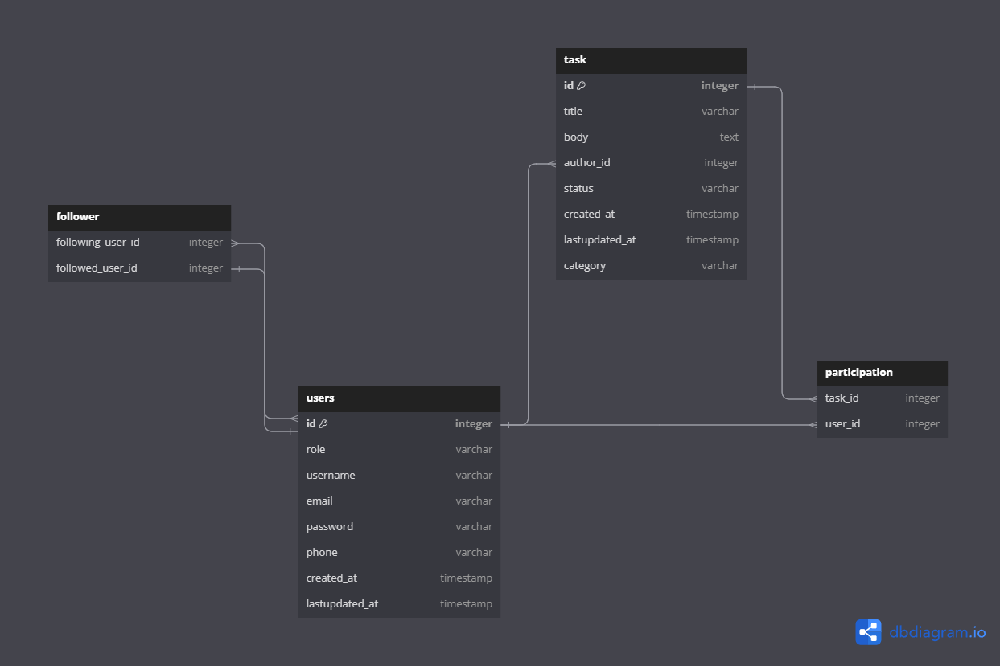

## Todo

This is a Webapplication to get started in Fullstack Development.

Frameworks used:
- Angular
- Laravel
- MySQL (will be later replaced by AWS)

## Bestandteile des Projekts

### Frontend

### Backend

### Database

https://dbdiagram.io/

## Allgemeine Nutzung der Applikation 
Der Nutzer soll in der Lage sein, anstehende Aufgaben auf dieser Applikation zu dokumentieren.
Die Aufgaben bestehen aus:
- Dem User der diese erstellt hat.
- Dem Datum an dem es erstellt wurde.
- Dem Datum mit der letzten Änderung (evtl. werden alle Änderung gelogt und auf Anfrage zur Verfügung gestellt.).
- Einem Titel.
- Einer Beschreibung.
- Der ID des Nutzers.
- Andere an der Aufgabe beteildigten Personen (später mit RT Chat für Besprechungsmöglichkeiten).
- Einer Deadline mit Reminder für diese Aufgabe.
- Eine Kategorisierung dieser Aufgabe (mit Kategorien die by default da sind, und später eigene Kategorien, dessen Wichtigkeit mit einem Scoring System berechnet werden kann).

Desweiteren muss der User sich authentifizieren können. Und abhängig von den Aufgaben an denen andere User beteildigt sind, müssen diese autorisiert werden, um entsprechende Änderungen vornehmen zu können.

## Admin Board

## AWS

## Scoring System
